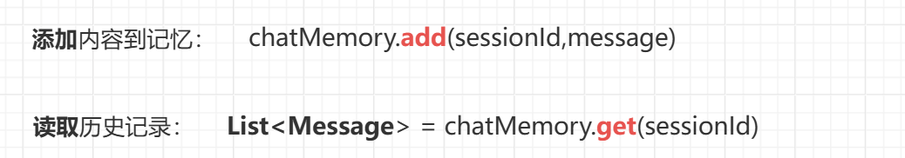

# 下面为该项目相关技术栈说明
## SpringAi

SpringAi为java集成各个大模型提供了一个抽象，可以方便开发Spring应用中的AI相关功能，包括：AI聊天、图片生成、语音识别等，[SpringAi官网](https://docs.spring.io/spring-ai/reference/index.html)

注意：1.0.0为正式版本，需要Spring Boot 3.4.x版本及以上

---

### 配置环境

- **pom文件配置**

1. 中央仓库定义（国内镜像还未更新springai）

   ~~~xml
   <repositories>
       <repository>
           <id>central</id>
           <url>https://repo.maven.apache.org/maven2</url>
       </repository>
   </repositories>
   ~~~
   
2. BOM定义（用于版本管理）

   ~~~xml
   <properties>
       <spring-ai.version>1.0.0-M6</spring-ai.version>
   </properties>
   <!-- ⚠ 必须在 dependencies 之前 -->
   <dependencyManagement>
       <dependencies>
         <dependency>
           <groupId>org.springframework.ai</groupId>
           <artifactId>spring-ai-bom</artifactId>
           <version>${spring-ai.version}</version>
           <type>pom</type>
           <scope>import</scope>
         </dependency>
       </dependencies>
   </dependencyManagement>
   ~~~

3. 引入依赖（ai core和所需要使用的大模型依赖）

   ~~~xml
   <!-- Spring AI 核心 -->
   <dependency>
       <groupId>org.springframework.ai</groupId>
       <artifactId>spring-ai-client-chat</artifactId>
   </dependency>
   <!-- deepseek 核心 -->
   <dependency>
       <groupId>org.springframework.ai</groupId>
       <artifactId>spring-ai-starter-model-deepseek</artifactId>
   </dependency>
   ~~~

- **appilication文件配置**

  ~~~yml
  spring:
    ai:
      deepseek:
        api-key: ${DEEPSEEK_API_KEY}
        base-url: "https://api.deepseek.com"
        model: "deepseek-chat"    // 指定模型名称
        options:         // 生成设置
          temperature: 0.8
          max-tokens: 500
        client:          // 网络设置
          connect-timeout: 10s
          read-timeout: 30s
          proxy:            // 代理设置
            host: 127.0.0.1
            port: 7890
      retry:         // 重试设置
        max-attempts: 3
      chat:
        memory:        // 对话记忆
          type: message-window
          capacity: 5     // 最多保留5条记忆
      model:
        chat: deepseek    // 当有多个模型时，指定聊天模型为deepseek
  ~~~
  
-    **Configure配置类**

  使用工厂模式，来创建ChatClient、ChatMemory实例

  ~~~java
  @Configuration
  public class ChatClientConfig {
   		 // 内存存储库，用于存储历史消息
      @Bean
      public ChatMemoryRepository chatMemoryRepository() {
          return new InMemoryChatMemoryRepository();
      }
      @Bean
      public ChatMemory chatMemory(ChatMemoryRepository repository) {
          // 使用工厂方法创建，避免直接调用私有构造器
          return MessageWindowChatMemory.builder()
                  .chatMemoryRepository(repository)
                  .maxMessages(10) // 保留最近10条消息
                  .build();
      }
      @Bean
      public ChatClient chatClient(ChatModel chatModel,ChatMemory chatMemory) {
          return ChatClient.builder(chatModel)
                  // 可选：添加自定义 Advisor（如日志记录、拦截器等）
            			// 会话历史管理
                  .defaultAdvisors(MessageChatMemoryAdvisor.builder(chatMemory).build())
                  .build();
      }
  }
  ~~~

---

### 常用接口

1. **ChatClient：**对ChatModel的封装，与AI模型交互的主要接口，用于发送消息并获取响应，支持流式对话、工具调用、人设设置等

注意：引入springai的依赖后，通过自动配置，可以直接在项目中注入ChatClient

~~~java
@Autowired
private ChatClient chatClient;

@Autowired
private ChatClient chatClient;

@PostMapping("/ask")
public String ask(@RequestBody String question) {
    System.out.println("前端发送了请求："+question);
    // ✅自动构建prompt
    String content = chatClient.prompt()
      .user(question)
      .call()         //非stream对话
      .content();
  	
    System.out.println("后端返回了结果："+content);
    return content;
}
~~~

2. **Message：**表示对话中的一条消息，例如用户提问、AI回复、系统提示等

   | 类型                | 说明             |
   | ------------------- | ---------------- |
   | UserMessage         | 用户发送的消息   |
   | AssistantMessage    | AI回复的消息     |
   | SystemMessage       | 系统初始化的消息 |
   | ToolResponseMessage | 表示工具调用     |

   常用方法：

   - getText：返回消息的内容，如用户提问内容

3. **Prompt：**表示发送给AI模型的请求，包含消息和可选参数

注意：调用chatclient的user（）方法自动构建prompt、在prompt（prompt）手动构建提示词

~~~java
public class Prompt implements ModelRequest<List<Message>> {
    private final List<Message> messages;    // 消息（通常是问题）
    @Nullable
    private ChatOptions chatOptions;     // 参数
		...
}
~~~

4. **ChatMemoryRepository：**~~会话存储仓库~~，支持存储多用户，多会话，存储结构为一个Map，通过chatID区别会话


5. **ChatMemory：**用于维护上下文，底层是一个List<Message>，对话历史存储在会话存储仓库中，当调用chatclient时，将由Advisor自动从内存中根据会话ID检索历史对话



~~~java
@Autowired
private ChatMemory chatMemory;

@Autowired
private ChatClient chatClient;
@PostMapping("/ask")
    public Map<String, Object> ask(
            @RequestBody Map<String, String> request,
            @RequestHeader(value = "X-Session-ID", defaultValue = "default") String sessionId
    ) {
        chatMemory.add(sessionId, new UserMessage(request.get("message")));

        // 2. 调用AI（自动关联记忆）
        String aiResponse = chatClient.prompt()
          ..system("你现在是一个用户助手，尽量满足客户需求！")
          .user(request.get("message"))
          .call()
          .content();

        // 3. 添加AI响应到记忆
        chatMemory.add(sessionId, new AssistantMessage(aiResponse));

        // 4. 返回当前完整对话历史（供前端展示）
        List<Message> history = chatMemory.get(sessionId);
    }
~~~

---

### 流式对话

#### SseEmitter

**流式传输：**AI的响应一点一点传送给客户端，不需要等到全部生成完毕再传输，可以提高用户体验；可以借助**SSE**协议或**WebSocket**协议实现流式传输

**SSE：**基于HTTP协议，服务器~~主动推送~~数据到客户端，无需客户端频繁请求，只能服务器推送给客户端

Spring Framework提供的一个类，用于支持SSE协议；保持HTTP连接长时间打开，持续向客户端推送数据，允许异步发送多条消息

1. 创建SseEmitter对象

~~~java
SseEmitter emitter = new SseEmitter(Long timeout);
~~~

2. 发送推送数据

~~~java
emitter.send(Object object);
~~~

3. 结束推送，关闭连接

~~~java
emitter.complete();
~~~

4. 异常处理

~~~java
emitter.completeWithError(e);   // 发生异常时
~~~

---

#### 响应式编程

**异步流：**数据并非立即全部产生的，来源于网络等异步源（如消息队列、AI模型输出）；提前定义好了数据怎么处理；特点：~~非阻塞~~，数据随来随处理

**响应式编程：**~~异步非阻塞~~的编程范式，**提前声明当数据来了时如何处理**，系统会在数据真正到来时自动响应

Java中主要使用Reactor库来实现响应式编程

---

- **Publisher**

**发布者**，数据的产生源头，也叫数据流，通过subscribe方法实现数据的推送

类型：

Mono<T>：表示0或1个元素的异步序列

Flux<T>：表示0~N个元素的异步序列

~~~java
// 从多个值创建
Flux<String> flux1 = Flux.just("A", "B", "C");
// 间隔生成
Flux<Long> fluxInterval = Flux.interval(Duration.ofSeconds(1)); // 每秒一个数字
// 从Stream创建（注意必须是响应流）
Flux<String> flux4 = Flux.fromStream(Stream.of("A", "B", "C"));
// 由sink转换而成
Flux<User> flux = sink.asFlux(); 
~~~

- **操作符**

用于定义对异步数据流的操作，如过滤、转换、错误处理、副作用操作；有点类似于Stream流中的操作

| 操作符    | 作用     | 举例                            |
| --------- | -------- | ------------------------------- |
| filter()  | 过滤     | flux.filter( i -> i%2 == 0)     |
| take(n)   | 取前n个  | flux.take( n )                  |
| after(n)  | 取后n个  | flux.after( n )                 |
| **map()** | 同步转换 | flux.map( s - > s.toUpperCase ) |

副作用操作符：~~**不修改数据流的情况**~~下进行某些操作（如日志记录、状态更新等）

| 操作符         | 作用                   |
| :------------- | ---------------------- |
| doOnNext()     | 流每发送一个数据时触发 |
| doOnComplete() | 流正常完成时触发       |
| doOnError()    | 因错误终止时触发       |

- **订阅方法**

数据流只有**~~被订阅才会开始执行~~**，Flux的subscribe方法订阅

subscribe（）方法接收及一个Subscriber，

```java
flux.subscribe();    // 消费者被简写
flux.subscribe(
		item - > sout(item)      // 定义消费者onNext方法
)
```

通过链式编程，可以简洁优雅地对一个流进行处理

~~~java
Flux<String> flux = Flux.just("Hello", "World", "from", "Reactor")
    										.delayElements(Duration.ofSeconds(1))
           						  .map(s -> s.toUpperCase());
												.doOnnext(System.out::println)
                        .subscribe();
~~~

#### 流式对话

借助SseEmitter建立流式连接，并使用Flux对异步流进行处理

~~~java
@GetMapping(value = "/stream", produces = MediaType.TEXT_EVENT_STREAM_VALUE)
    public SseEmitter stream(
            @RequestParam("message") String message,
            @RequestHeader(value = "X-Session-ID", defaultValue = "default") String sessionId
    ) {
        System.out.println("用户发送：" + message);
        SseEmitter emitter = new SseEmitter(0L); // 不超时

        // ✅ 拷贝为可变列表
        List<Message> history = new ArrayList<>(chatMemory.get(sessionId));

        // ✅ 添加用户消息
        UserMessage userMessage = new UserMessage(message);
        history.add(userMessage);

        // ✅ 构建 Prompt
        Prompt prompt = new Prompt(history);

        new Thread(() -> {     // 为了不阻塞主线程
            StringBuilder buffer = new StringBuilder();
            chatClient.prompt(prompt)
                      .stream()// 这个流不是Java8中的Stream，而是Spring AI的响应式流
                      .content() // ✅ 返回 Flux<String>
                      .subscribe(     // 消费者逻辑
                              item->{
                                buffer.append(item);
                                try {
                                  emitter.send(item);     // 推送给客户端
                                } catch (IOException e) {
                                  emitter.completeWithError(e);
                                }
                              },     // doOnNext
                              emitter::completeWithError,   // doOnError
                              () -> {
                                System.out.println("AI回复：" + buffer.toString());
                                chatMemory.add(sessionId, new AssistantMessage(buffer.toString())); // 加入到对话记忆
                                try {
                                  emitter.send(SseEmitter.event().name("end").data("[done]"));   // 发送特殊事件通知前端结束
                                } catch (IOException e) {
                                  emitter.completeWithError(e);
                                }
                                emitter.complete();   // 关闭 SSE 连接，结束流式推送
                              }   // doOnComplete
               					     );
            }).start();
       return emitter; // 返回 SseEmitter 对象，建立连接
}
~~~

---

### 工具调用

为AI模型提供一组可交互的API，增强AI的能力，以回复之前所不能回复的问题（比如：查询天气、时间等信息、查询数据库等）

1. **声明调用逻辑**

**ToolCallBack**：回调工具，用来定义可以被AI调用的方法（查询数据库）；通过@Tool（description=”“）来声明

- 其中~~description~~用来说明AI会在什么情况调用改方法，如果需要传递参数，使用@ToolParam（description=）来说明参数

~~~java
@Component
public class UserTools {
  
    @Autowired
    private IBlogService blogService;

    @Tool(description = "帮我查询某用户的笔记")
    public String getUserBlog(@ToolParam(description = "用户名")String nickname){
        Long userId = getId(nickname);
        List<Blog> list = blogService.query()
                .eq("user_id", userId)
                .list();
        return JSONUtil.toJsonStr(list);
    }
}
~~~

2. **传入ChatClient**

~~~java
// 多个调用工具
MethodToolCallbackProvider ToolCallback = MethodToolCallbackProvider.builder()
                .toolObjects(shopTool,userTools,dateTimeTools)  // 3个需要调用的工具
                .build();

        new Thread(() -> {     // 为了不阻塞主线程
            StringBuilder buffer = new StringBuilder();
            chatClient.prompt(prompt)
                    .toolCallbacks(ToolCallback)
                    //.tools(shopTool)单个工具调用
              			...
~~~

注意：工具调用的结果默认会作为参数传递入AI模型，用于生成回复；如果不想传递入模型，可以在声明时设置returnDirect = false)

~~~java
@Tool(description = "帮我查询博客、笔记",returnDirect = false)  // 结果不返回给模型
~~~

---

### RAG

RAG：Retrieval Argmented Generation（增强检索生成），是一种有助于客服大模型在长篇内容、事实准确性和上下文感知局限性的技术，基于**向量数据库**实现

#### 向量数据库

**Vector Database**：向量数据库是专门用于存储、索引和检索向量数据的数据库；在大模型中，文本、图片、

音频等非结构化数据经常会被转化为有利于机器理解语义的~~向量形式~~，特点是支持~~高效的相似性搜索~~

向量数据库的实现方式：**Pgvector**、Chroma、Milvus、redis等

redis实现向量数据库需要借助redis-stack模块（仅支持redis7+），可以使用docker部署

~~~base
# Docker方式创建并运行Redis Stack
docker run -d --name redis-stack -p 6379:6379 -p 8001:8001 redis/redis-stack:latest
~~~

---

##### SpringAI配置

1. 引入依赖

~~~xml
<!--redis向量数据库-->
<dependency>
    <groupId>org.springframework.ai</groupId>
    <artifactId>spring-ai-starter-vector-store-redis</artifactId>
</dependency>
~~~

2. application中配置redis连接信息
3. 自定义嵌入模型（下一节）
4. 配置redis向量数据库

~~~java
@Configuration
public class RedisVectorConfig {
    @Bean
    public VectorStore vectorStore(JedisPooled jedisPooled, EmbeddingModel embeddingModel) {
        return RedisVectorStore.builder(jedisPooled, embeddingModel)
                .indexName("custom-index")                // rediSearch索引名称，默认 "spring-ai-index"
                .prefix("custom-prefix")                  // redis key前缀 defaults to "embedding:"
                .metadataFields(                         // 定义想要支持的元数据字段
                        RedisVectorStore.MetadataField.tag("country"),
                        RedisVectorStore.MetadataField.numeric("year"))
                .initializeSchema(true)                   // 是否在启动时自动创建rediSearch索引 defaults to false
                .batchingStrategy(new TokenCountBatchingStrategy()) // 分批嵌入策略
                .build();
    }
    @Bean
    public JedisPooled jedisPooled() {
        return new JedisPooled("192.168.88.128", 6380);
    }
}
~~~

---

##### 嵌入模型

**Embedding Model**：嵌入模型，将文本、图像和音频转换为浮点数数据（向量），嵌入数组的长度称为向量的维数；通过计算两个向量的距离可以得到两个向量的相似程度

在springai中一些大模型已经实现了嵌入模型的接口（openai、Ollama等），一些模型没有实现嵌入模型的接口（deepseek、Qwen等），我们可以调用具备Ollama的嵌入模型

在本地下载Ollama之后执行下面命令

~~~base
ollama serve     # 启动ollama服务
ollama pull nomic-embed-text  # 下载一个开源嵌入模型
~~~

1. 环境配置

~~~java
<!--ollama的嵌入模型-->
<dependency>
    <groupId>org.springframework.ai</groupId>
    <artifactId>spring-ai-starter-model-ollama</artifactId>
</dependency>
~~~

~~~xml
spring:
  ai:
    ollama:      # 使用本地ollama的嵌入模型
      base-url: http://localhost:11434      # ollama服务默认启动在localhost:11434
      embedding:
        model: nomic-embed-text     # 嵌入模型名称
    model:
      embedding:
        text: ollama   # 使用ollama作为文本嵌入模型
~~~

配置完成后，EmbeddingModel自动注册到IOC容器中，配置在向量数据库后，会在数据库add、相似性查找自动调用嵌入模型

---

##### Document

在SpringAI中，Document表示带文本内容的对象，可以存储文本、图片、音频等多种数据，作为~~与向量数据库交互~~的核心对象

~~~java
public class Document {
    public static final ContentFormatter DEFAULT_CONTENT_FORMATTER = DefaultContentFormatter.defaultConfig();
    private final String id;     // 文档唯一标识
    private final String text;   // 文档正文
    private final Media media;   // 存放音频图片内容
    private final Map<String, Object> metadata;   // 元数据，作者、时间、标签
    @Nullable
    private final Double score;    // 向量匹配得分、仅查询结果中返回
    @JsonIgnore
    private ContentFormatter contentFormatter;  // 内容格式化器

    @JsonCreator(
        mode = Mode.PROPERTIES
    )
  ...
~~~

---

##### VectorStore

向量数据库，在配置完redis的向量数据库后，可以之间通过依赖注入使用向量数据库

**核心操作**

1. 添加内容：调用**vector**.**~~add~~**(List<Document>)方法

~~~java
@Autowired
private VectorStore vectorStore;
List <Document> documents = List.of(
    new Document("Spring AI rocks!! Spring AI rocks!! Spring AI rocks!! Spring AI rocks!! Spring AI rocks!!", Map.of("meta1", "meta1")),
    new Document("The World is Big and Salvation Lurks Around the Corner"),
    new Document("You walk forward facing the past and you turn back toward the future.", Map.of("meta2", "meta2")));
// Add the documents to Redis
vectorStore.add(documents);
~~~

2. 相似度查找：调用**vector.similaritySearch()**方法，返回一个Document的List对象

~~~java
List<Document> results = vectorStore.similaritySearch("今年的雨果奖会是谁呢");  // 默认查询前4条最相关数据
~~~

---

#### RAG

##### ETL管道

ETL管道是负责提取、转换和加载RAG用例中的数据，可以将读取数据、分割为Document

- DocumentReader：读取数据（text、PDF、JSON等），生成Document

~~~java
// 配置文本读取器，将txt转换为Document列表
@Component
class MyTextReader {

    private final Resource resource;
		// 类路径为src/main/resource
    MyTextReader(@Value("classpath:text-source.txt") Resource resource) {
        this.resource = resource;
    }
    List<Document> loadText() {
        TextReader textReader = new TextReader(this.resource);
        textReader.getCustomMetadata().put("filename", "text-source.txt");
        return textReader.read();
    }
}
~~~

- **文本分割器**：TokenTextSpliter

将一个Document列表，分割为一个个具有语义的块，返回一个新的更细化的Document列表

~~~java
@Autowired
private MyTextReader textReader;

List<Document> documents = textReader.loadText();
List<Document> apply = splitter.apply(documents);
vectorStore.add(apply);   // 存入向量数据库
~~~

---

##### LangChain4j

Langchain4j是java版的Langchain，相比于SpringAI，langchain4j提供了更为丰富强大的**处理工具**（文本分割器、标记器等）

langchain包含有多种文本分割器（按行分割、按句子分割、多层策略组合分割），在这里我们使用按句子语义分割

1. 引入Langchain4j依赖

~~~xml
<!--langchain4j依赖-->
<dependency>
    <groupId>dev.langchain4j</groupId>
    <artifactId>langchain4j</artifactId>
    <version>0.29.0</version>
</dependency>
~~~

2. 配置分割器

注意：

- DocumentTransformer是SpingAI中的一个定义文档处理的标准接口，用来执行存入矢量数据库前的操作
- Langchain4j没有提供SpringBean的注册机制，因此需要手动配置bean

~~~java
@Component
public class SentenceSplitterAdapter implements DocumentTransformer {

    private final DocumentBySentenceSplitter splitter = new DocumentBySentenceSplitter(200,20);

    @Override
    public List<Document> transform(List<Document> input) {
        List<Document> result = new ArrayList<>();
        for (Document doc : input) {
            dev.langchain4j.data.document.Document l4jDoc = new dev.langchain4j.data.document.Document(doc.getText());
            List<TextSegment> segments = splitter.split(l4jDoc);
            for (TextSegment segment : segments) {
                result.add(new Document(segment.text(), doc.getMetadata()));
            }
        }
        return result;
    }

    @Override
    public List<Document> apply(List<Document> documents) {
        return transform(documents);
    }
}
~~~

3. 使用文本分割器

~~~java
@Autowired
private DocumentTransformer sentenceSplitter;

@Test
public void testSplitter() {
    TextReader textReader = new TextReader(resource);
    List<Document> documents = textReader.get();
    List<Document> apply = sentenceSplitter.transform(documents);
  	...
~~~

##### QuestionAnswerAdvisor


